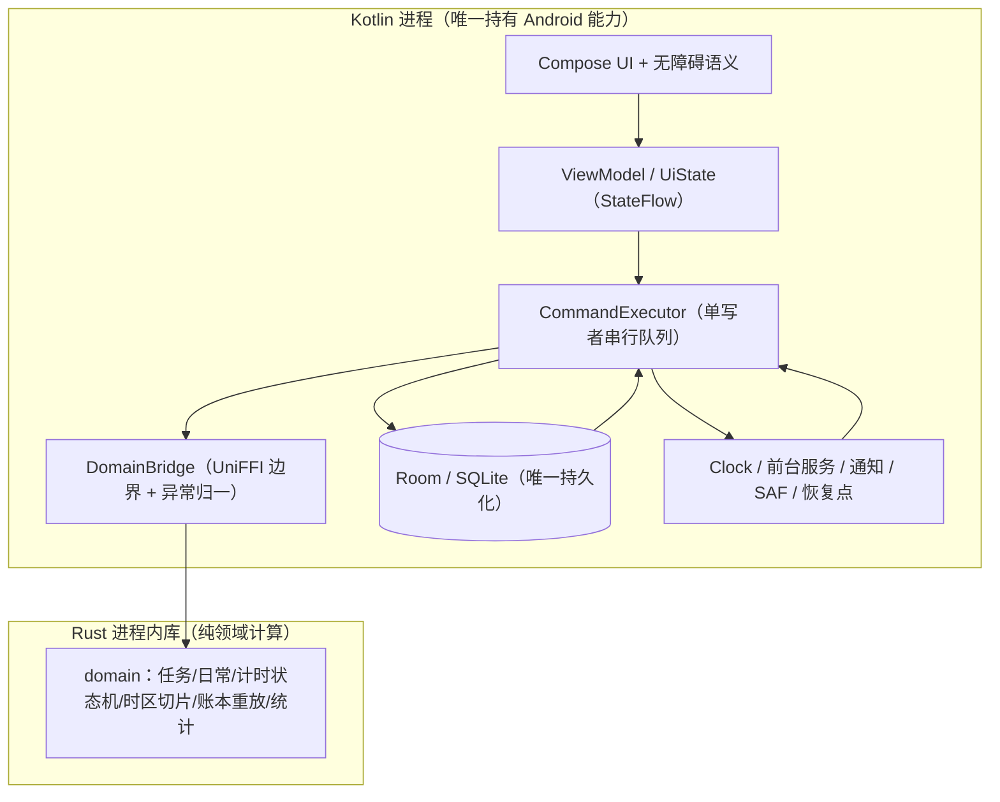

# 架构契约（Kotlin ↔ UniFFI ↔ Rust ↔ Room）

> 状态：实施契约 v3.0，2026-10-05。依据为已放行的《Android 个人艺术 Todo 开发需求规格》v1.0（下称"规格"）与《需求访谈与决策记录》（下称"访谈"）Q51 确认的 A 路线。
>
> **v3.0 修正清单**（独立评审 N1–N11，全部经本轮实测或回读规格/访谈后处理）：N1 panic 门禁命令；N2 FFI 级 panic 遏制补实测；N3 午夜 DST 日窗口；N4 账本排序锚点改回规格口径；N5 kind=2 行的编辑/删除；N6 视图约束与审计表补入表清单；N7 恢复判定与心跳锚点；N8 allowBackup 冲突裁定；N9 悬空的"见 v1.0"引用；N10 Q7 共享账本无 AC 覆盖；N11 构建证据可复验性声明。
>
> 标记：**[契约]** 强制项；**[实测]** 本轮实际运行命令并读到输出；**[源码引证]** 只读了源码未运行；**[未验证]** 本轮未运行。

## 0. 本轮实测依据

| 编号 | 事实 | 证据 |
| --- | --- | --- |
| E1 | Gradle 8.11.1（`E:\devtools\gradle`） | `gradle.bat --version` → `Gradle 8.11.1` |
| E2 | wrapper 缓存目录名 = base36(md5(distributionUrl))；`gradle-8.13-bin` 命中且含 `.ok` | 计算得 `5xuhj0ry160q40clulazy9h7d`，与实测目录名一致 |
| E3 | **单 crate 布局下全部 cargo 门禁命令逐字可用** | `cargo test --manifest-path rust/Cargo.toml --test occurrences` → `1 passed`，EXIT=0；整包 `cargo test` → EXIT=0；`cargo fmt --check` → EXIT=0；`cargo clippy --all-targets -- -D warnings` → EXIT=0；`cargo build --release` → EXIT=0 |
| E4 | 绑定生成在单 crate 布局可用，`uniffi.toml` 位于 crate 根即生效 | `cargo run --release --bin uniffi-bindgen -- generate --library target/release/arttodo_core.dll --language kotlin --no-format --out-dir …`（cwd=`rust/`）→ EXIT=0，`arttodo_core.kt` 首行 `package app.arttodo.core`，含 `func dayBounds` |
| E5 | **[F11] 本机 wrapper 缓存只有 `gradle-8.13-bin`** | `ls -1a "E:/caches/gradle/wrapper/dists/"` → `CACHEDIR.TAG`、`gradle-8.13-bin`；`ls -d …/gradle-8.11.1-bin` 与 `…/gradle-8.7-bin` 均 `No such file or directory` |
| E6 | Compose BOM 2026.09.00 需 `minCompileSdk=37` + AGP≥9.1.0，本机不可用 | 读 `ui-android-1.12.1.aar` 的 aar-metadata → `minCompileSdk=37 minAndroidGradlePluginVersion=9.1.0` |
| E7 | AGP 8.12.3 + Gradle 8.13 + Kotlin 2.4.20 + KSP 2.3.12 + Compose BOM 2026.06.01 + Room 2.8.5 可编译出 APK | `assembleDebug` → `BUILD SUCCESSFUL`，`app-debug.apk` 12,454,972 字节；`testDebugUnitTest`、`clean lintDebug` 均成功 |
| E8 | 依赖解析被 init 脚本改写为阿里云镜像，构建走镜像完成 | 生效仓库 = `maven.aliyun.com/repository/{google,public,gradle-plugin}` |
| E9 | Rust 可算 IANA 时区自然日长度 | `America/New_York 2026-03-08 = 82800 s`、`2026-11-01 = 90000 s` |
| E10 | `jiff` 的 instant→本地日期与日窗口 API 可用 | `Timestamp::to_zoned(tz)` → `ms=1773030000 -> date=2026-03-09 time=00:20:00 offset=-04` |
| E11 | `catch_unwind` 遏制依赖 profile：默认 unwind → 返回 `Err`；`panic="abort"` → 进程终止 | 同探针：默认 profile → `catch_unwind returned Err? true`，EXIT=0；`[profile.abort]` → EXIT=127 |
| E12 | UniFFI 用 `catch_unwind` 遏制 panic | **[源码引证]** `uniffi_core-0.32.2/src/ffi/rustcalls.rs:207` `let result = panic::catch_unwind(callback);`，:228 第二层 |
| E13 | 仅 JDK 17；Robolectric 可在 JDK 17 跑 Room 文件库往返 | `java -version` → `Temurin-17.0.19`；Robolectric 4.17 + Room 2.8.5 用例 `tests="1" failures="0"` |
| E14 | 无真机/模拟器；唯一 AVD 属他项目 | `adb devices -l` → 仅表头；`emulator -list-avds` → `axcoder_phase0_api35` |
| E15 | Rust → Android 交叉编译不可行 | `rustup target list --installed` → 仅 `x86_64-pc-windows-msvc`；`E:/Android/Sdk/ndk` 不存在；`cargo build --target aarch64-linux-android` → exit 101 |
| **E16** | **[N1] panic 门禁命令的正确形态** | `cargo rustc --manifest-path rust/Cargo.toml --release --lib -- --print cfg` → 输出 `panic="unwind"`，EXIT=0；把 `[profile.release] panic` 改成 `abort` 后同一命令 → `panic="abort"`（门禁会失败）；fresh crate 上连续两次运行稳定。**两种错形态**：省略 `--lib` → `error: extra arguments to 'rustc' can only be passed to one target …`（本 crate 同时有 lib 与 bin）；省略 `--` → `error: the print flag is unstable, and only available on the nightly channel of Cargo, but this is the stable channel`，EXIT=101 |
| **E17** | **[N2] FFI 级 panic 遏制已实证**：真实 `#[uniffi::export]` 函数 panic 不终止进程，被转成状态码 2 + panic 消息 | 用 ctypes 调 `uniffi_n2core_fn_func_boom`（`RustCallStatus` 为 `repr(C)`：code:i8@0、error_buf{cap,len,ptr}@8/16/24）：调用**正常返回**，`status.code=2`（UnexpectedError），`error_buf` 长度 36，payload = `b'intentional panic for boundary probe'`；对照 `uniffi_n2core_fn_func_checked` → `status.code=0`（Success） |
| **E18** | **[N2] 上述遏制在 `panic="abort"` 下失效**：同一调用终止宿主进程 | 以 `[profile.abortprobe] panic="abort"` 重建后调用同一函数 → **宿主进程终止，EXIT=127**，"RETURNED NORMALLY" 未打印、未写入任何 `RustCallStatus` |
| **E20** | **[实现约束] UniFFI 不支持元组返回类型**：三个领域返回类型必须是具名 record | 把 `day_window_ms` 写成返回 `(i64, i64)` 时编译失败：`error[E0277]: the trait bound '(i64, i64): LowerReturn<UniFfiTag>' is not satisfied` 与 `the trait bound '(i64, i64): uniffi::TypeId<UniFfiTag>' is not satisfied`；改为 `#[derive(uniffi::Record)] pub struct DayWindowMs { start_ms, end_ms }` 后 `--test occurrences` → **3 passed**，EXIT=0（同一 build 亦生成绑定成功） |
| **E19** | **[N3] 午夜发生 DST 跳变时，连续两日的 `DayWindow` 仍严格首尾相接（每刻恰属一日）** | jiff 0.2.37 实测：`America/Sao_Paulo 2018-11-04` start=`01:00:00-02:00` len=82800s，与 11-03 的 end **CONTIGUOUS**；`Asia/Beirut 2018-03-25` start=`01:00:00+03:00` len=82800s CONTIGUOUS；`America/Santiago 2018-08-12` start=`01:00:00-03:00` len=82800s CONTIGUOUS；`America/Havana 2018-11-04` len=90000s CONTIGUOUS。**该日不存在 `00:00` 这个时刻**，`at(0,0,0,0).to_zoned()` 产生的是前滚后的 01:00 |

## 1. 分层与职责边界



**[契约] Rust 禁止清单**：不读写数据库或文件；不持有 Room/SQLite 连接；不调系统时钟、不读环境时区；不起线程、不跑后台循环（无 `tokio`、无 `std::thread::spawn`）；不感知 `Activity`/`Service`/`Context`/`Notification`；不做 I/O；不输出成句文案（只返回结构化错误码与 `Notice`，文案在 Kotlin）。

**[契约] Rust 允许清单**：纯函数式 `reduce(state, command) -> outcome`；时区/应用日期/日窗口/切片计算（`jiff`，E9/E10/E19 已验证）；账本重放与统计投影；输入校验。

**取舍**：曾考虑让 Rust 用 `rusqlite` 直连库，否决理由：违反规格第 8 节与 Q51 的"Kotlin 唯一拥有 Room 读写与迁移"；跨语言事务无法与 Kotlin 对齐；需为每个 ABI 再链一份 SQLite。

## 2. 应用日期、时区与切片的唯一口径

**[契约] 核心裁决：`app_date` 只由 Rust 计算，Kotlin 与 UI 一律不得自行推算。**

### 2.1 规范时间模型

**[契约] UniFFI 返回类型约束（E20 实测）**：跨 FFI 的返回类型**必须是具名 `#[derive(uniffi::Record)]` / `uniffi::Enum`**，**不得使用 Rust 元组** —— 返回 `(i64, i64)` 会编译失败（`trait bound '(i64, i64): LowerReturn<UniFfiTag>' is not satisfied`）。下文所有结构即为此约束下的定义。

```rust
pub struct AppDate {            // 应用日期：civil date 标签
    pub iso: String,            // "YYYY-MM-DD"
    pub zone_epoch_seq: u32,    // 生成该标签时生效的时区纪元
}

pub struct DayWindow {
    pub app_date: AppDate,
    pub start_wall_ms: i64,     // 该自然日首刻（含）
    pub end_wall_ms: i64,       // 次日首刻（不含）
    pub day_seconds: i64,       // = (end - start)/1000
}

pub struct IntervalSlice {
    pub slice_id: String,       // 确定性，见 §6
    pub app_date: AppDate,
    pub start_wall_ms: i64,
    pub end_wall_ms: i64,
    pub title_snapshot: String,
}
```

### 2.2 四个必须存在的命令/查询

| 命令 | 语义 | 实现要点 |
| --- | --- | --- |
| `AppDateOf { wall_ms, zone_epoch_seq? }` | 瞬间 → 应用日期 | `Timestamp::to_zoned(zone).date()`（E10） |
| `CurrentAppDate { now }` | "今天" | = `AppDateOf { wall_ms: now.wall_ms }`。启动、跨日、时区变更后**必须重新调用**，Kotlin 不得自行加一天 |
| `DayWindow { app_date }` | 该自然日的窗口与秒数 | 见 §2.3 的午夜-DST 规则 |
| `SliceInterval { start_wall_ms, end_wall_ms, title_revisions }` | 把一段有效区间切成按日归属的片段 | **必须**以 `DayWindow` 的 `[start, end)` 为边界逐日推进 |

**[契约] 单一函数强制**：`SliceInterval` 的日边界只允许来自 `day_window()`；`day_seconds` 只能由该窗口端点相减得出。**禁止**固定 `86400`、**禁止**按 offset 差值推算日长。必须有测试断言 `DayWindow(d).day_seconds == SliceInterval` 在该日切出的秒数和。

### 2.3 午夜发生 DST 跳变（N3 修正）

**问题**：规格第 11 节 AC-08 的例子用"23:50–00:20"，涉及午夜。而某些时区在午夜当天跳过 `00:00`。v2.0 只说"取该日期 civil 00:00"，没有定义这时 `start_wall_ms` 的含义，AC-08 的期望值会因取值策略而变。

**[实测] E19 的事实**：`America/Sao_Paulo 2018-11-04`、`America/Santiago 2018-08-12`、`Asia/Beirut 2018-03-25` 三例的本地 `00:00` **不存在**，`at(0,0,0,0).to_zoned()` 产生的是前滚后的 `01:00`（len=82800s）；`America/Havana 2018-11-04` 的 `00:00` 存在但当日 len=90000s。

**[契约] 定义（立即可实现、不依赖 jiff 的取值策略被写进契约）**：

1. `DayWindow(d).start_wall_ms` = **`Date(d).at(00:00).to_zoned(zone)` 的 timestamp**，即"该日 civil 00:00 在该时区的时间戳"；若该 civil 时刻不存在（前跳），jiff 返回前滚后的时刻（E19 实测为 01:00），**契约接受该语义并把它写为定义**。
2. `DayWindow(d).end_wall_ms` = `DayWindow(d + 1 day).start_wall_ms`。**不得**独立计算次日的窗口终点。
3. **日窗口严格首尾相接**（E19 在四个时区实测成立：每天的 end 恰等于次日的 start）。因此 `[start, end)` 构成对时间轴的**精确划分**，每一刻恰属一日，无空隙、无重叠。
4. **切片只用 `[start, end)` 区间与瞬间比较**定位所属日期；**禁止**由 `AppDateOf` 的"当天日期名"决定切片归属。理由：`00:00–01:00` 这类区间里，`AppDateOf` 与"落在哪个 `[start,end)`"可能看起来不一致，而 AC-08 要求的是**分配上的精确性**（前日 10 分钟、后日 20 分钟），所以必须用区间划分。
5. **`AppDateOf` 只用于"今天是什么日期"这类标签问题**；日期归属（切片、日总量、热力图格子）一律用 `DayWindow`。

**[契约] 新增必测用例（N3）**：在 `America/Sao_Paulo` 构造 `2018-11-04`（午夜跳过日）与 `America/Havana` 构造 `2018-11-04`（25 小时日）两组测试，断言：(a) `DayWindow` 首尾相接；(b) 跨该日的一段区间切分后合计秒数 == 区间长度；(c) 任取一刻 `t`，恰有一个 `DayWindow` 满足 `start <= t < end`。

### 2.4 时区的两个来源必须区分

| 情形 | Kotlin 行为 | Rust 行为 | 依据 |
| --- | --- | --- | --- |
| **系统时区变化** | **不产生任何 `zone_epoch` 行**；继续按当前纪元送时钟 | 按既有 `zone_epoch` 计算，历史不重算 | 规格 3、AC-15 |
| **用户手动改应用时区** | 先弹预告；在计时先要求结束并保存；确认后调 `AppendZoneEpoch` | 追加新 `zone_epoch`；同任务同 `app_date` 已有实例则复用 | 规格 3、AC-15 |

**[契约] 跨纪元同标签求和**：`ledger_entry` 逐条保存发生时的 `zone_epoch_seq`（供明细显示原始时区与时间），但**聚合一律按 `(task_id, app_date.iso)` 标签**，使规格 3 的"跨纪元产生相同日期标签的两段投入在该日期统一求和"成立。实例唯一键为 `(task_id, app_date.iso)`，**不含纪元**。

## 3. UniFFI 接口

### 3.1 形态与生成

**[契约]** 进程宏导出（`#[uniffi::export]` + `setup_scaffolding!`），不引入 UDL（本轮探针中 UDL 与 `setup_scaffolding!` 并用产生 70 处冲突）。

**[契约] 调用粒度**：只在**用户命令**与**投影查询**两个粒度调用。禁止每 tick 调 FFI；秒级刷新在 Kotlin 用本地锚点推算。

### 3.2 命令信封与结果

```rust
pub struct CommandEnvelope {
    pub command_id: String,        // 幂等键，Kotlin 生成一次并在全部重试中复用
    pub issued_at: ClockSample,
    pub expected_revision: u64,
}

pub struct DomainOutcome {
    pub next_state: DomainState,
    pub effects: Vec<LedgerEffect>,   // Kotlin 必须在同一事务内落库
    pub notices: Vec<Notice>,         // 供 UI 提示（含 §4.3 的 kind=2 影响提示）
    pub error: Option<DomainError>,
}
```

| 命令 | 关键参数 | 说明 |
| --- | --- | --- |
| `CreateTask` | kind, title, note, issued_at | 日常创建后当天即有效 |
| `RenameTask` | task_id, title | 产生切片边界（AC-14） |
| `EditNote` | task_id, note | 无历史版本 |
| `ArchiveTask` / `UnarchiveTask` | task_id | 与完成独立；不产生完成事件（AC-10） |
| `ReorderTasks` | kind, ordered_task_ids | 单命令写整组 sort_key |
| `SetTaskRecentCountdown` | task_id, minutes | **只在点"开始"后调用**（AC-04） |
| `StartSession` / `PauseSession` / `ResumeSession` | task_id, mode, target_seconds? / session_id | 开段即持久化 open segment（§6） |
| `FinishSession` | session_id, completion: Option<CompletionChoice> | 提前结束/到点/切任务共用 |
| `CompleteTaskWhileRunning` | session_id, target_app_date? | 先确认，再原子结束+完成（AC-07/AC-08） |
| `EnsureOccurrence` | task_id, app_date | 幂等；同日复用 |
| `SetOccurrenceCompletion` | task_id, app_date, completed: bool | **事件溯源唯一入口**（§4.1） |
| `CompleteTemporary` / `ReopenTemporary` | task_id | 追加事件，保留历史（AC-11） |
| `AddManualSeconds` | task_id, app_date, seconds>0 | 只增加 |
| `SetDailyTotalSeconds` | task_id, app_date, total_seconds>=0 | 绝对总量修正事件 |
| **`EditLedgerEntry`** | `ledger_seq`, `new_delta_seconds: Option<i64>`, `new_set_total_seconds: Option<i64>` | **N5 修正**：可编辑 kind=1 与 kind=2 两种行；恰好一个为 `Some` 且必须与行的 `kind` 匹配，否则 `LedgerInvariantViolation`。原地改值、保留 `ledger_seq` |
| **`DeleteLedgerEntry`** | `ledger_seq` | 逻辑删除，**保留顺序槽**；删除 kind=2 行时**必须**返回 `Notice { affected_app_date, resulting_total_seconds }`（规格 6.1"删除设置事件恢复它之前的账本贡献，必要时提示影响的日期与总量"） |
| `RebuildOccurrenceView` | —— | 从事件重建派生视图（§4.1） |
| `AppendZoneEpoch` | zone_id, impact_summary | 手动改应用时区 |
| `ResolveRecovery` | session_id, choice: Accept\|Modify\|Discard, seconds? | §7 |
| 时间口径 | `AppDateOf`、`CurrentAppDate`、`DayWindow`、`SliceInterval` | §2.2 |
| 查询 | `ProjectDay` / `ProjectRange` / `ProjectHeatmap` / `ProjectTaskShares` | 统计唯一口径 |

### 3.3 事件（effects）

`UpsertTask`、`InsertTitleRevision`、`UpsertOccurrence`、`AppendOccurrenceCompletionEvent`、`UpsertOccurrenceView`、`AppendCompletionEvent`、`OpenSegment`、`CloseSegment`、`AppendLedgerEntry`、**`UpdateLedgerEntry`（kind=1 与 kind=2 通用）**、**`InsertLedgerEntryAudit`**（N5/N6，每次编辑或删除前写审计）、`SoftDeleteLedgerEntry`、`UpsertZoneEpoch`、`SetHeartbeatAnchor`、`ClearActiveSession`。

**[契约]** `effects` 是**意图**不是 SQL；`DomainBridge` 把全部 `effects` 与 `command_log` 插入放进**同一个 Room `@Transaction`**。

### 3.4 错误映射与异常通道（N2 修正）

```rust
pub enum DomainError {
    EmptyTitle, TitleTooLong { max: u32 }, NoteTooLong { max: u32 },
    NegativeSeconds, CountdownMinutesOutOfRange { min: u32, max: u32 },
    TaskNotFound, SessionNotFound, SessionAlreadyFinished,
    ConcurrentSession { active_session_id: String },
    RevisionConflict { expected: u64, actual: u64 },
    PreconditionFailed { reason: String },
    OccurrenceNotFound, InvalidAppDate, InvalidZoneId,
    DuplicateCommand, LedgerInvariantViolation { detail: String },
    Internal { detail: String },
}
```

| Rust 错误 | UniFFI 生成的 Kotlin 类型 | Kotlin 归一为 | UI 行为 |
| --- | --- | --- | --- |
| `EmptyTitle` / `TitleTooLong` / `NoteTooLong` | 生成的用户错误 sealed class（包级，名字由 `uniffi.toml`/crate 决定） | `DomainFailure.Validation` | 就地字段错误 |
| `CountdownMinutesOutOfRange` | 同上 | `DomainFailure.Validation` | 输入框错误提示（上限 1440） |
| `ConcurrentSession` | 同上 | `DomainFailure.Conflict` | 弹"结束当前计时并开始新任务"确认（AC-06） |
| `RevisionConflict` / `PreconditionFailed` | 同上 | `DomainFailure.Conflict` / `PreconditionChanged` | 重取状态并重新校验前置条件（§5.2） |
| `DuplicateCommand` | 同上 | 不作为错误暴露 | 返回既有 `result_digest`，视为成功 |
| `LedgerInvariantViolation` | 同上 | `DomainFailure.Internal` | 阻断操作 + 明确提示，不写库 |
| **Rust panic** | **`InternalException`**（生成代码的包级类，非用户错误 sealed class） | `DomainFailure.Internal` | 提示后可重试；**不得崩溃** |

**[契约] N2 修正的准确表述**：

1. **两类 Kotlin 异常必须都捕获**：生成代码里用户错误以**该 crate 的用户错误 sealed class**（其确切类名由 crate 名决定，例如错误类型 `CoreError` → `CoreException`）表示；Rust panic 则以 **`InternalException`** 表示。`DomainBridge` 必须同时 catch 两者。
2. **panic 路径已实证存在且有效**（E17）：真实 `#[uniffi::export]` 函数 panic 时，FFI 调用**正常返回**、状态码为 `2`（UnexpectedError）、`error_buf` 携带 panic 消息；生成代码据此在 `:287` 抛 `InternalException`。**[未验证]** 生成代码在何种条件下走到 `:289` 的兜底字面量 `"Rust panic"`（`error_buf` 不可解码时）——本轮未构造该条件。
3. **该遏制依赖 `panic="unwind"`**（E18：`panic="abort"` 下同一调用终止宿主进程），故 §10 的 profile 约束是这条契约的前提。
4. **[未验证]** 用户错误 sealed class 的确切类名在其它 crate/`uniffi.toml` 配置下是否变化。契约**不写死类名**，只要求"捕获该 crate 的错误父类与 `InternalException`"。

```kotlin
sealed interface DomainFailure {
    data class Validation(val code: String) : DomainFailure
    data class Conflict(val code: String, val activeSessionId: String?) : DomainFailure
    data class PreconditionChanged(val reason: String) : DomainFailure
    data class NotFound(val code: String) : DomainFailure
    data class Internal(val detail: String) : DomainFailure
}
sealed interface DomainResult {
    data class Success(val outcome: DomainOutcome) : DomainResult
    data class Failure(val failure: DomainFailure) : DomainResult
}
```

**[契约]** `DomainBridge` 每个方法返回 `DomainResult`，**不得抛出未声明异常**；实现必须在桥边界 catch 用户错误父类与 `InternalException`。

## 4. Room：事件溯源与单一真相

### 4.1 真相分层（F2 修正，维持）

| 层 | 表 | 权威性 | 谁写 |
| --- | --- | --- | --- |
| **权威（append-only 事件）** | `occurrence_completion_event` | **唯一真相** | `SetOccurrenceCompletion` / `CompleteTaskWhileRunning`；只追加 |
| **派生视图（可重建缓存）** | `daily_occurrence_view` | **不是真相**，可全量重建 | 与事件**同一事务**写入 |
| 事实（生成有效性） | `daily_occurrence` | 生成事实的真相 | `EnsureOccurrence` |

**[契约] 一致性保证**：
1. `daily_occurrence_view` 携带 `derived_from_event_high_water`（已并入的最大 `event_seq`）。
2. 唯一写路径是"追加事件 + 同事务更新视图"，不存在只写视图不写事件的路径。
3. **必须**有等价性测试：随机事件序列下 `RebuildOccurrenceView` 的结果与增量维护的视图逐字段相等。
4. AC-03 的"撤销完成"与 AC-07 的"到点不自动完成"**都断言同一处**（`daily_occurrence_view` == 事件重放），不再出现一处读列、一处读事件。

### 4.2 表结构（含 N6/N9 修正）

| 表 | 关键列 | 索引 / 约束 | 规格对应 |
| --- | --- | --- | --- |
| `task` | `task_id` PK, `kind`, `title`, `note`, `sort_key`, `created_wall_ms`, `archived_at_ms` NULL, `last_countdown_minutes` DEFAULT 25, `art_asset_id` NULL | `INDEX(kind, archived_at_ms, sort_key)`；`art_asset_id` → `art_asset(asset_id)` FK（可空） | AC-02/AC-04/AC-10 |
| `task_title_revision` | `revision_seq` PK AUTOINCREMENT, `task_id` FK, `title`, `effective_wall_ms`, `effective_app_date`, `zone_epoch_seq` | `INDEX(task_id, effective_wall_ms)`；FK → `task` | AC-14 |
| `daily_occurrence` | `occurrence_id` PK, `task_id` FK, `app_date` TEXT, `zone_epoch_seq`, `display_title_snapshot`, `created_at_ms` | **`UNIQUE INDEX(task_id, app_date)`**；FK → `task` | 规格 3"同一任务同一日期最多一条" |
| `occurrence_completion_event` | `event_seq` PK AUTOINCREMENT, `occurrence_id` FK→`daily_occurrence`, `action`(0完成/1撤销), `occurred_wall_ms`, `app_date`, `zone_epoch_seq` | `INDEX(occurrence_id, event_seq)`；**FK 显式声明并开启 `PRAGMA foreign_keys=ON`** | **权威** |
| **`daily_occurrence_view`** | `occurrence_id` PK, `is_completed` INT, `completed_wall_ms` NULL, `derived_from_event_high_water` INT | **N6 修正：`occurrence_id` 显式 FK → `daily_occurrence(occurrence_id)` ON DELETE CASCADE**；1:1 关系由"`occurrence_id` 同时是 PK 与 FK"保证 | AC-03/AC-07 |
| `temporary_completion_event` | `event_seq` PK AUTOINCREMENT, `task_id` FK, `action`, `occurred_wall_ms`, `app_date`, `title_snapshot` | `INDEX(task_id, event_seq)`；FK → `task` | AC-11 |
| `focus_session` | `session_id` PK, `task_id` FK, `mode`, `target_seconds` NULL, `state`, `created_wall_ms`, `finished_wall_ms` NULL, `source` | `INDEX(task_id, created_wall_ms)`、`INDEX(state)`；FK → `task` | 5.1 状态表 |
| `session_segment` | `segment_id` PK, `session_id` FK→`focus_session`, `seg_seq`, `start_wall_ms`, `end_wall_ms` NULL, `start_elapsed_ms`, `end_elapsed_ms` NULL, `start_boot_tag`, `end_boot_tag` NULL, `title_snapshot`, `zone_epoch_seq`, `derived` | **`UNIQUE INDEX(session_id, seg_seq)`**；FK → `focus_session` | AC-05/AC-08/AC-14 |
| `active_session_slot` | **`slot_id` PK（恒为 1）**, `session_id` UNIQUE FK→`focus_session` | 主键恒 1 ⇒ 至多一行 | 唯一计时器（DB 级） |
| `ledger_entry` | `ledger_seq` PK AUTOINCREMENT, `kind`(0自动切片/1手动增加/2设为总量), `ref_id` NULL, `task_id` FK, `app_date`, **`occurred_wall_ms`**（可信发生时间，N4 必需）, `zone_epoch_seq`, `delta_seconds` NULL, `set_total_seconds` NULL, `created_wall_ms`, `edited_at_ms` NULL, `is_deleted`, `deleted_at_ms` NULL | `INDEX(task_id, app_date, occurred_wall_ms, ledger_seq)`；**`UNIQUE INDEX(kind, ref_id)`（kind=0）**；FK → `task` | AC-12/AC-13 |
| **`ledger_entry_audit`** | `audit_seq` PK AUTOINCREMENT, `ledger_seq`（→ 逻辑引用 `ledger_entry`，**不加 FK**，因目标行会被逻辑删除但审计须永存）, `prev_delta_seconds` NULL, `prev_set_total_seconds` NULL, `new_delta_seconds` NULL, `new_set_total_seconds` NULL, `changed_at_ms`, `change_kind`(0编辑/1删除/2恢复) | `INDEX(ledger_seq, audit_seq)` | **N6 修正：规格 6.1:130"保留原始有效区间与修改前值"** |
| `zone_epoch` | `epoch_seq` PK AUTOINCREMENT, `zone_id`(IANA), `effective_wall_ms`, `impact_summary`, `created_wall_ms` | 首装写 `epoch_seq=1` | AC-15 |
| `session_heartbeat` | `session_id` PK, `wall_ms`, `elapsed_ms`, `boot_tag`, `heartbeat_kind`(0周期/1状态迁移) | 单行 UPSERT；**确认边界**，见 §7 | AC-09 |
| `command_log` | `command_id` PK, `applied_wall_ms`, `command_kind`, `result_digest`, `expected_revision`, `actual_revision` | 幂等键 | 5.1 |
| `art_asset` | `asset_id` PK, `source`(来源 URL/出处), `license`(许可证或购买协议版本), `license_scope`(允许的商用/修改/再分发范围), `attribution`(署名要求), `evidence_path`(归档证明), `sha256`, `width`, `height`, `color_space`, `crop_safe_area` | **N9 修正：按视觉提示词"硬要求"逐项记录** | 视觉提示词 |
| `app_setting` | `key` PK, `value` | 声音/震动/固定时区指针/备份格式版本 | 设置页 |
| `backup_record` | `record_id` PK, `kind`(0 DAILY/1 PRE_RESTORE), `created_wall_ms`, `file_path`, `size_bytes`, `sha256`, `manifest_json` | **N9 修正**：日点 7 个滚动、`PRE_RESTORE` 不计入滚动 | AC-16 |

**[契约] 稳定提交顺序**：`ledger_seq INTEGER PRIMARY KEY AUTOINCREMENT` 仍提供单调、不可回退、**且不随 `ORDER BY` 变化**的稳定序号，但它是**并列打破键**而非重放主键 —— 主排序见 §4.3（N4 修正）。

**[契约] 唯一计时器的 DB 级保证**：`active_session_slot` 主键恒 1，使第二个活动会话在物理上无法写入。

**[设计默认] sort_key**：组内 1024 步长；插入取中值；间隙耗尽（差 < 2）时单事务重排该组。

### 4.3 账本重放：排序锚点与编辑语义（N4 / N5 / N8 修正）

#### 4.3.1 排序锚点改回规格口径（N4）

**问题**：v2.0 把重放改成纯 `ledger_seq ASC`，与规格 6.1:129 原文冲突。规格原文："**某日的切片顺序按可信发生时间确定，同一时刻再以稳定记录序号打破并列**"。因为日常实例是**惰性生成**的，行**生成顺序可以晚于其发生时间**：一段 23:50–00:20 的会话，昨天的切片行可能在今天若干行之后才被写入，此时 `ledger_seq` 顺序与可信发生时间顺序相反，"早于 set 被覆盖、晚于 set 继续累加"的结论随之不同。

**[契约] 重放顺序定义**：

```
对给定 (task_id, app_date.iso) 的账本，重放顺序 =
    ORDER BY occurred_wall_ms ASC, ledger_seq ASC
```

- `ledger_entry.occurred_wall_ms` = 该条贡献的**可信发生时刻**：kind=0 取切片起点；kind=1 取该手动增加命令的 `issued_at.wall_ms`；kind=2 取该"设为总量"命令的 `issued_at.wall_ms`。
- `ledger_seq` 仅作**同一时刻的并列打破键**，保证全序确定（规格 6.1:129 的"稳定记录序号"）。
- `created_wall_ms` 保留为审计字段（行何时被写入），**不参与重放排序**。

**[契约] 新增必测用例**：构造"生成顺序 ≠ 发生时间顺序"的场景（昨天的切片行后于今天的行写入），断言聚合按 `occurred_wall_ms` 而非 `ledger_seq` 得出，且与"把同样的行按发生时间顺序插入"的结果一致。这是 N4 要求的守护测试，v2.0 的用例全部用显式 seq 顺序、不覆盖此场景。

#### 4.3.2 编辑与删除的两种语义（N5 修正）

1. **编辑 = 原地改值、保留 `ledger_seq`**（`EditLedgerEntry`）。依据规格 6.1:128 原文"编辑已存在记录时保留该记录原有顺序槽及修改审计，**不把一次编辑当作新追加事件移到最近一次设置之后**"。所以**绝不**用"追加新事件"实现编辑。
2. **`EditLedgerEntry` 覆盖 kind=1 与 kind=2**：`new_delta_seconds`（kind=1）与 `new_set_total_seconds`（kind=2）恰好一个为 `Some` 且与行的 `kind` 匹配；不匹配返回 `LedgerInvariantViolation`。v2.0 只能改 kind=1，与规格 6.1:126"可修改、删除记录"（覆盖所有来源）不符。
3. **删除 kind=2 必须提示影响**：`DeleteLedgerEntry` 删除 kind=2 行时返回 `Notice { affected_app_date, resulting_total_seconds }`，UI 必须展示（规格 6.1:128"必要时提示影响的日期与总量"）。
4. **删除仍是逻辑删除、保留顺序槽**：`is_deleted=1`，该行在重放中跳过但**保留其 `ledger_seq` 与 `occurred_wall_ms`**。
5. **编辑与删除前必须写审计**：`ledger_entry_audit` 记录 `prev_*` 与 `new_*`，使逻辑删除后仍可审计与恢复（规格 6.1:130"保留原始有效区间与修改前值"）。

#### 4.3.3 重放规则与四个已裁决场景

规则：按 §4.3.1 的顺序遍历；`kind=1` 累加 `delta_seconds`；`kind=2` 把此刻累计值**置为** `set_total_seconds`；其后的条目继续累加；`is_deleted=1` 跳过。

| 场景 | 事件序列 | 逐步累计 | 终值 |
| --- | --- | --- | --- |
| S1（AC-12） | +20, +30, set 35, +10 | 20 → 50 → **35** → 45 | **45** |
| S2（AC-13，编辑 set 之前的条目） | +20→**+40**, +30, set 35, +10 | 40 → 70 → **35** → 45 | **45** |
| S3（AC-13，删除 set 条目） | +40, +30, (set 35 已删), +10 | 40 → 70 → 70 → 80 | **80** |
| S4（编辑 set 之后的条目） | +20, +30, set 35, +10→**+25** | 20 → 50 → 35 → 60 | **60** |
| **S5（N5，编辑 kind=2 行）** | +20, +30, set 35→**set 50**, +10 | 20 → 50 → **50** → 60 | **60** |

**[契约] 明确回答 v1.0 的歧义**："删除设置事件恢复它之前的账本贡献"= S3，恢复的是**编辑后的当前值**（40+30+10=80），不是编辑前的原值——原值只存在于 `ledger_entry_audit`，不参与聚合。

**[契约] AC-12 与 AC-13 不冲突**：AC-12 用 S1（终值 45，规格第 11 节原文"20、50、35、45 分钟"）；AC-13 用 S2/S3；N5 用 S5。

## 5. 唯一计时器与并发裁决

### 5.1 状态机

```
None ──StartSession──▶ Running ──PauseSession──▶ Paused
                          │  ▲                      │
                          │  └────ResumeSession─────┘
                          ├──FinishSession──▶ Finished
                          ├──CompleteTaskWhileRunning(confirmed)──▶ Finished + 完成事件
                          └──进程异常重建（见 §7 判定）──▶ RecoveryPending
Paused ──FinishSession / CompleteTaskWhileRunning / 切任务确认──▶ Finished
RecoveryPending ──ResolveRecovery──▶ Finished
```

### 5.2 单写者与冲突裁决（F6 修正，维持）

1. **进程内单写者**：所有状态变更经 `CommandExecutor` 的**单一串行队列**（单线程 dispatcher + `Mutex`）。所有组件（Activity、Compose、前台服务、通知 `BroadcastReceiver`、`WorkManager`）**必须运行在默认进程**，禁止 `android:process` 分进程。
2. **重放前必须重新校验前置条件**：`RevisionConflict` 或串行队列重取状态后发现 `revision` 已变时，**不得无条件重放**；必须以新状态重跑 `preconditions(state, command)`，通过才重放，否则返回 `PreconditionFailed { reason }` 由 UI 重新确认。
3. **`active_session_slot` 主键恒 1 作为 DB 级兜底**。

| 命令 | 前置条件 | 失败返回 |
| --- | --- | --- |
| `StartSession` | 无活动会话，或活动会话 ID == 命令携带的 `replaces_session_id` | `ConcurrentSession` / `PreconditionFailed` |
| `Pause`/`Resume`/`FinishSession` | 目标 `session_id` == 当前活动会话，且状态允许该迁移 | `SessionNotFound` / `PreconditionFailed` |
| `CompleteTaskWhileRunning` | 目标 == 当前活动会话 | `PreconditionFailed` |
| `ResolveRecovery` | 会话状态 == `RecoveryPending` | `PreconditionFailed` |
| `EditLedgerEntry`/`DeleteLedgerEntry` | `ledger_seq` 存在且未删除；参数与 `kind` 匹配 | `NotFound` / `LedgerInvariantViolation` |

## 6. 确定性键与命令重放幂等

**[契约] 四条确定性规则**：

1. **`session_id` 在 `StartSession` 生成一次并立即持久化**到 `focus_session` 与 `active_session_slot`；进程重建后**必须从库读取**，**禁止**重新生成。
2. **`segment_id = f"{session_id}:{seg_seq}"`**，`seg_seq` 在会话内单调递增；不用随机 UUID。
3. **开段时立即持久化 open segment**：`StartSession`/`ResumeSession` 在同一事务内写入 `session_segment` 行（`start_*` 已填、`end_*` 为 NULL）。
4. **`slice_id = f"{session_id}:{seg_seq}:{slice_start_wall_ms}:{zone_epoch_seq}"`** —— 只是这些确定性输入的哈希/拼接，**不含当前时间、不含随机数、不含命令 ID**。重复提交同一恢复动作会算出**同一个** `slice_id`，被 `UNIQUE INDEX(kind=0, ref_id)` 拒收。

**[契约] 分工**：`command_id` 防**同一命令实体**重复提交（生命周期 = 一次用户操作 + 其重试链）；`slice_id` 防**同一段时间**被二次入账（生命周期 = 该段本身，跨进程重建、跨命令 ID 有效）。

**[契约] 测试**：开段 → 杀进程 → 恢复并接受，重复执行接受动作 3 次，断言该切片的 `ledger_entry` 只有一行、当日总秒数不翻倍。

## 7. 异常恢复：判定、心跳与入账（F4 / N7 修正）

### 7.1 与 AC-09 对齐的入账语义（F4，维持）

| 概念 | 定义 |
| --- | --- |
| **可信段** | `[segment.start_wall_ms, heartbeat.wall_ms]`，心跳为崩溃前**最后一次成功持久化**的锚点 |
| **空档（gap）** | `[heartbeat.wall_ms, recovery_wall_ms]`，**用户确认前一律不入账** |

| 用户选择 | 入账秒数 | 空档 |
| --- | --- | --- |
| **接受 Accept** | 可信段 + 空档 | 入账 |
| **修正 Modify** | 用户输入的权威秒数 | 以用户值为准 |
| **舍弃 Discard** | **只写可信段**；空档丢弃 | **不入账** |

**[契约] 关键约束**：`heartbeat.wall_ms` 必须是"最后一次成功持久化的心跳时刻"，**不是**"会话最后已知时刻"，故 `heartbeat < 崩溃时刻`、空档恒非空。心跳间隔 15 秒（1 行 UPSERT，不产生账本行）。倒计时场景接受时推算段最多补足该段 `target_seconds`。

### 7.2 心跳锚点的写入时机（N7 修正）

**问题**：v2.0 丢弃了 v1.0"启动/暂停/继续/结束时刻额外立即写一次心跳"的规定，只剩 15 秒周期心跳与"StartSession 写 open segment"。这既让锚点精度不可控，也让"何时判为待恢复"无定义 —— 而进入待恢复的判定若只看"心跳旧"，就会把**从未被杀的正常会话**误判（规格 5.2 原文："正常锁屏和切应用不弹此选择"）。

**[契约] 心跳写入时机（必须全部实现）**：

| 时机 | 说明 |
| --- | --- |
| `StartSession` / `ResumeSession` | 开段同事务写一次（`heartbeat_kind=1`） |
| `PauseSession` | 结算刚结束区间后立即写一次（`heartbeat_kind=1`） |
| `FinishSession` / `CompleteTaskWhileRunning` | 关闭段前写一次（`heartbeat_kind=1`） |
| Running 期间 | 每 15 秒 UPSERT 一次（`heartbeat_kind=0`），通过**前台服务**驱动 |

### 7.3 进入 `RecoveryPending` 的判定（N7 修正，新增）

**[契约] 判定必须同时满足两个条件**：

```
RecoveryPending(session) ⇔
    (DB) focus_session.state(session) ∈ {Running, Paused}
  且 (DB) active_session_slot.session_id == session
  且 (内存) 本进程的 SessionOwner 单例未把该 session 标记为“由本进程持有”
```

- **心跳的陈旧程度绝不作为判定条件**：心跳只决定进入待恢复后**空档有多长**。
- `SessionOwner` 是进程内的内存单例：`StartSession`/`ResumeSession` 成功后在内存中登记该 `session_id`；`FinishSession` 清除。**只要本进程持有该会话，就永不进入 `RecoveryPending`**，无论界面静置多久、心跳多久没写。
- **每进程只在启动时评估一次**：应用启动（或前台服务首次启动）时做一次判定；此后同进程内不重复评估。这样"进程在前台静置 25 分钟"不会被误判。
- **[未验证]** `SessionOwner` 的持有状态在系统仅重建 Activity（进程仍在）时是否可靠保持 —— 取决于 Kotlin 侧实现（应放在 `Application` 级或前台服务级单例，而非 Activity）。本轮无设备，未验证；实施时必须有一条"同进程重建 UI 不进入 RecoveryPending"的设备测试（见《AC覆盖表》AC-09 的负例断言）。

**[契约] 不触发条件**：正常锁屏、切 App、正常前后台转换、同进程 Activity 重建**都不得**进入 `RecoveryPending`。

## 8. 备份、隐私与系统自动备份（N8 修正）

### 8.1 allowBackup 的冲突裁定（N8）

**问题**：v1.0 有"管理 `android:allowBackup`/`dataExtractionRules`"，v2.0 静默删除；而规格 9.1:187 仍要求"评估并配置 Android 系统自动备份策略，使其不造成用户不知情的云传输"，访谈 Q3（:91）与 Q47（:715）已确认"不得默认增加云账号、服务器或自动云同步""不上传、不替代可搬走文件"。

**[契约] 裁定（写入清单，不再缺失）**：

1. `AndroidManifest.xml` 中显式声明 **`android:allowBackup="false"`**，并配置 **`android:dataExtractionRules`**（API 31+）与 `android:fullBackupContent`（API ≤ 30）**同时排除云备份（cloud backup）与设备迁移（device-to-device transfer）**。
2. 理由：规格 9.1 要求"不造成用户不知情的云传输"；在"无账号、不上传"已确认的前提下，最省歧义的做法就是不由系统带走数据库。本应用的安全网是**本机 7 日滚动恢复点 + 用户手动导出**（规格 9.2）。
3. **代价必须如实告知**：关闭系统备份意味着换机不能靠 Google 账户恢复，用户必须手动导出/导入。该说明必须出现在设置页的恢复点区域（规格 9.2"界面明确提醒定期手动导出到应用之外"）。
4. **[契约] 若用户日后要求系统自动备份**，属规格变更：须单独评估云传输语义、更新隐私描述、并重新设计"不同时恢复两个版本状态"的机制（规格 9.1 原文）。

### 8.2 备份内容与加密

- 内容：`magic`、`backup_format_version`、`created_wall_ms`、`app_db_version`、`zone_epoch_history[]`、各表行数与逐表摘要、`sha256` 或 `kdf/aead` 参数。覆盖规格 9.2 全部条目；**不含**日志、密码、凭据。
- 加密：`PBKDF2WithHmacSHA256`（API 26+）+ `AES/GCM/NoPadding`（API 19+），随机 salt/nonce，参数随文件保存。**[契约] 不自创密码学**；迭代次数在实施时按当时 OWASP 建议复核后锁定并记录来源。
- **恢复是完整替换，绝不静默合并**（规格 9.2）。

### 8.3 原子替换与崩溃恢复状态机（F9 修正，维持）

| 步 | 动作 | 产出物 |
| --- | --- | --- |
| ① | SAF 选择文件（不申请全盘权限） | —— |
| ② | 复制到 `cacheDir/import/<uuid>/`，限 512 MiB | `import/incoming` |
| ③ | 校验 magic/版本/长度；明文校验 `sha256`，加密校验 GCM tag。**错误密码 → 明确报错，不触碰现有库** | —— |
| ④ | 只读打开，`PRAGMA integrity_check` 必须 `ok` | —— |
| ⑤ | 校验表行数与引用完整性，与清单比对 | —— |
| ⑥ | **迁移干跑并落盘** | **`app.db.pending`（本步生成）** |
| ⑦ | 校验 pending 行数/摘要，再 `integrity_check` | —— |
| ⑧ | 生成 `PRE_RESTORE` 保护点 | `backup_record` 一行 |
| ⑨ | 写 `restore.intent.json`；`wal_checkpoint(TRUNCATE)` 并关库 | **`restore.intent.json`** |
| ⑩ | 交换：`app.db` → `app.db.old`；`app.db.pending` → `app.db`；清理陈旧 `-wal`/`-shm` | `app.db.old`、新 `app.db` |
| ⑪ | 重开 Room，重算 identity hash 与行数，与清单比对 | —— |
| ⑫ | 成功 → 删 `app.db.old` 与 `restore.intent.json` | —— |

**[契约] 崩溃恢复状态机**（覆盖 ⑨–⑫ 任意中断点）：

| 标记 | `app.db` | `pending` | `old` | 动作 |
| --- | --- | --- | --- | --- |
| 存在 | 有效且 == 清单 | —— | 存在 | **提交**：删 `old` + 标记 |
| 存在 | 缺失或校验不符 | 有效 | —— | **前滚**：pending → app.db |
| 存在 | 有效（旧库） | 存在/缺失 | 不存在 | **回滚**：删 pending 与标记 |
| 存在 | 缺失 | 缺失/无效 | 存在 | **回滚**：`old` → app.db |
| 不存在 | —— | 存在 | —— | 清理 pending |

**[契约]** 任何分支必须收敛到"全旧"或"全新"，不允许半开。

### 8.4 本机恢复点

每天首次数据变更最多 1 个日点；保留最近 7 个滚动；每次恢复前生成 `PRE_RESTORE` 点且**不计入 7 天滚动**；无变化不写重复副本；空间不足明确告警，**不假称已备份**；UI 必须说明本机恢复点会随卸载/设备损坏丢失。

## 9. 前端状态流

```
Room（唯一真相）→ Room Flow → Repository（合并 Rust 投影）→ ViewModel(StateFlow) → Composable
```

- **[契约] 单向数据流**：UI 只读 `StateFlow`；变更经 `dispatch(Action) → CommandExecutor → DomainBridge`。
- **[契约] UI 不算业务**：日期归属、完成状态、日/周/月总量、热力图值一律来自 Room 或 Rust 投影。Composable 内**禁止**日期运算、时区换算、时长求和。"今天"来自 `CurrentAppDate`，并在启动、跨日广播、时区变更后刷新（§2.2）。
- **[契约] 局部刷新**：只有专注页与首页计时卡用 1 秒 ticker，且只影响该 Composable 局部状态。
- **[契约] 导航入口**：今天 / 记录 / 洞察 / 设置 四个底部目标 + `focus` 全屏模态路由（不占第五项）。路由表由 `ui-navigation` 独占。
- **[契约] 可测接口**：`DomainBridge` 是 Kotlin 接口，生产走 UniFFI，测试用脚本化 fake；返回类型统一 `DomainResult`（§3.4），使 UI 测试不依赖 `.so`。

## 10. panic 边界与门禁（N1 / N2 修正）

**[契约] `[profile.release] panic = "unwind"` 是强制项。**

依据：[实测] E17 —— 真实 `#[uniffi::export]` 函数 panic 时，FFI 调用**正常返回**、`status.code=2`、`error_buf` 携带 panic 消息，进程存活；[实测] E18 —— `panic="abort"` 下同一调用**终止宿主进程**（EXIT=127）。故 [源码引证] E12 所依赖的遏制**只在 `panic="unwind"` 下成立**。

**[契约] 三重保障**：
1. 显式 `panic = "unwind"`；
2. `DomainError::Internal` + `DomainFailure.Internal` 映射通道（§3.4），把可预期的内部错误转为返回值；
3. Rust 边界输入**不得 panic**：所有外部输入先校验并返回 `DomainError`；保留的 `unwrap`/`expect` 必须有不变量注释并逐处评审。

**[契约] N1 修正：panic 策略必须有真正的门禁命令。** v2.0 写的 `cargo rustc --print cfg` 形态在 stable 上不可用；本轮实测确定正确形态与错误形态：

| 形态 | 结果 |
| --- | --- |
| `cargo rustc --manifest-path rust/Cargo.toml --release **--lib** -- --print cfg` | **可用**，EXIT=0，输出 `panic="unwind"`；把 `[profile.release] panic` 改为 `abort` 后同一命令输出 `panic="abort"` ——**能真正守住该强制项**，且在 fresh crate 上稳定（E16） |
| 同上但**省略 `--lib`** | **在本布局下报错**：`error: extra arguments to 'rustc' can only be passed to one target, consider filtering the package by passing, e.g. --lib or --bin NAME to specify a single target`。原因：§1.1 的 crate **同时有 lib 与 bin**（`uniffi-bindgen`）（E16） |
| `cargo rustc --release --print cfg`（省略 `--`） | **不可用**：`error: the print flag is unstable, and only available on the nightly channel of Cargo, but this is the stable channel`，EXIT=101（E16） |

**[契约] 因此 §11 的门禁清单必须包含**（断言输出为 `panic="unwind"`，否则门禁失败）：

```
cargo rustc --manifest-path rust/Cargo.toml --release --lib -- --print cfg
```

**[契约] `--lib` 不可省略**：本 crate 同时有 lib 与 bin 两个目标，省略 `--lib` 会直接报错（见上表第二行）。若实现方愿意用 nightly 或改用 `-Z`，属等价替代，但**必须**在门禁中留下一条能因 profile 改动而失败的命令；v2.0 的四条 cargo 命令没有一条能守住这一点。

## 11. 测试基线

| 主题 | 关键断言 | AC |
| --- | --- | --- |
| 日常惰性生成幂等 | 同 `(task_id, app_date)` 反复 `EnsureOccurrence` 结果不变 | AC-01/AC-15 |
| 完成事件重放等价 | `RebuildOccurrenceView` == 增量视图 | AC-03/AC-07 |
| 暂停不累计 | 10 分运行 + 3 分暂停 + 5 分运行 = 900 秒 | AC-05 |
| 跨午夜切片 | 23:50–00:20 → 前日 600 秒、次日 1200 秒 | AC-08 |
| **午夜 DST 日窗口**（N3） | `America/Sao_Paulo 2018-11-04` 与 `America/Havana 2018-11-04`：日窗口首尾相接；切分合计 == 区间长度；任一刻恰属一日 | AC-08/AC-15 |
| 切片/日长同源 | `DayWindow(d).day_seconds == SliceInterval` 在该日切出的秒数和 | AC-08/AC-15 |
| DST 自然日 | 23/25 小时（E9/E19 已证可行） | AC-15 |
| app_date 一致性 | 同一 `wall_ms` 经 `AppDateOf` 与经 `SliceInterval` 归属一致（归属以区间为准） | AC-08/AC-15 |
| 归档/恢复 | 归档期不生成、不造漏做；恢复同日复用实例 | AC-10 |
| 标题快照切片 | 改名瞬间切段，旧段用旧名 | AC-14 |
| **账本重放顺序**（N4） | 生成顺序 ≠ 发生时间顺序时，聚合按 `occurred_wall_ms` 而非 `ledger_seq`；同刻按 `ledger_seq` 打破并列 | AC-12/AC-13 |
| 账本重放终值 | S1=45；S2=45；S3=80；S4=60；**S5=60** | AC-12/AC-13 |
| **kind=2 编辑/删除**（N5） | 编辑 set 行生效；删除 set 行返回 `Notice` 含影响日期与结果总量；审计表留下 `prev_*`/`new_*` | AC-13 |
| **两种模式共享账本**（N10） | 同一 Task 同日在正向与倒计时各记一段 → 合并为**单一总量**，且日历/趋势/热力图/占比四处同值 | AC-12 |
| 切片唯一 | 同 `slice_id` 二次入账被拒 | AC-05/AC-09 |
| 恢复幂等 | 重复"接受"3 次，秒数不翻倍 | AC-09 |
| **不误判待恢复**（N7） | 同进程静置 25 分钟后重建 UI → **不得**进入 `RecoveryPending`；心跳陈旧不作为判定条件 | AC-09/AC-17 |
| 唯一会话与前置条件 | 第二个 `StartSession` → `ConcurrentSession`；前置条件失败 → `PreconditionFailed` | AC-06 |
| 时区纪元 | 历史不重算；同标签跨纪元求和 | AC-15 |
| 无 panic | 边界输入返回 `DomainError`；**且** `panic="unwind"` 门禁通过 | 全部 |

**门禁命令**（E3/E4/E16 实测）：

```
cargo test   --manifest-path rust/Cargo.toml --test occurrences
cargo test   --manifest-path rust/Cargo.toml
cargo fmt    --manifest-path rust/Cargo.toml --check
cargo clippy --manifest-path rust/Cargo.toml --all-targets -- -D warnings
cargo rustc  --manifest-path rust/Cargo.toml --release --lib -- --print cfg    # 断言 panic="unwind"
```

## 12. 可实施范围与证据可复验性（N11 / F12 修正）

**[契约] 本契约"可直接实施"的范围**：仅限**宿主目标（Windows x86_64）的 Cargo 编译、单元测试、lint、UniFFI 绑定生成**。**不包含** APK 内加载 `.so` 的交付物本体。

| 项 | 状态 | 依据 |
| --- | --- | --- |
| 宿主 cargo 门禁（test/fmt/clippy/build） | **已验证** | E3 |
| panic 门禁命令 | **已验证** | E16 |
| FFI 级 panic 遏制（宿主目标） | **已验证** | E17/E18 |
| 午夜 DST 日窗口 | **已验证**（jiff 层） | E19 |
| 单 crate 布局 + UniFFI 绑定生成 | **已验证** | E3/E4 |
| Gradle 编译 + 出 APK（不含业务 `.so`） | 本轮**已运行**（探针工程，E7），但见下方 N11 说明 | E7 |
| Rust → Android `.so` 交叉编译 | **阻塞** | E15 |
| APK 内加载真实 `.so` | **未验证** | 需先解除上一条 |
| 真机/隔离模拟器 | **阻塞** | E14 |
| `MigrationTestHelper` 无设备可用性 | **未验证** | E13 只证明 Robolectric 能跑 Room 往返 |
| 依赖校验和锁定（`verification-metadata.xml`） | **未验证** | 未生成 |
| 阿里云镜像长期可用性 | **未验证** | E8 仅本次 `200` |

**[契约] N11 修正：构建证据必须可复验。** v2.0 引用的探针工程目录（`D:\tmp\agptest`、`D:\tmp\rev2`）在产出本文件后**已被删除**，第三方已无法就地复跑 E3/E4/E7。

因此对每一条"已验证"的准确表述是：
- E3/E4/E16/E17/E18/E19：命令形态与结论已由本轮实跑确认，但**探针工程不保留**；复验需按《工程布局与版本锁定》§1.1 重建等价工程。
- E7（Gradle 三条门禁）：同样只在本轮实跑过，探针工程已删除。**本轮评审方无法复跑**（无产品工程、探针已删），故这三条现在**只有本契约的单方记录**，不应被当作第三方可复验的通过项。

**[契约] 补救要求**：产品工程一旦建立（阶段 C），必须在**工作区内**保留可复跑的探针/验收脚本于 `scripts/cmd/`，使上述命令可由第三方在本工作区直接复验，不再依赖 `D:\tmp` 临时目录。

**结论**：按本契约开工，会在 `jniLibs`/交叉编译处停住——**这是已知且已声明的边界**，不是意外。
