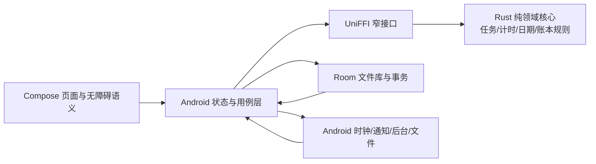

# 个人艺术 Todo 与专注计时：Android 开发需求规格

> 状态：根据 Q1–Q51 已确认选择形成的规格草案；**用户已于 2026-10-05 明确整体通过**（原话：「后面所有的评审全部通过，我要去睡觉了，我起来再验收」）。该通过是以预授权方式给出的，用户未逐页审阅，并说明事后自行验收；因此本文内容仍可能存在用户届时提出修订的可能。本文是后续实现依据，不代表应用已经开发、测试或发布。
>
> 版本：需求规格 v1.0。访谈证据见 [需求访谈与决策记录](需求访谈与决策记录.md)，视觉实施提示见 [艺术视觉与交互开发提示词](艺术视觉与交互开发提示词.md)。
>
> 标记约定：**[已确认]** 为用户明确选择，**[设计默认]** 为用户要求停止细节提问后由开发方补齐的必要规则，**[后期]** 为首版以外能力，**[验收]** 为可核查标准。设计默认若与已确认项冲突，以已确认项为准；若整体审阅时用户修改，须同步更新本文和访谈变更记录。

## 1. 产品定义与成功标准

一款供个人使用的 Android 原生任务与专注应用。打开后直接看到需要先处理的临时任务、随后看到今天的日常任务；从艺术任务卡片进入正向或倒计时专注，持续记录每个任务的投入，按日历和热力图复盘。高级艺术视觉、顺畅交互与可靠时间账本是并列的首版质量要求，其中**高级感是优先考虑的体验目标**。[已确认：Q1、Q4、Q9、Q19、Q21、Q51]

成功的体验不是功能数量，而是：启动能识别今天该做什么；临时事项绝不会被日刷新误清除；后台学习的时间可信；次日任务刷新不篡改昨天的事实；历史、日历、趋势和热力图显示相同的数；频繁使用仍觉得界面有吸引力、读得清、操作稳。[已确认的目标；可用性衡量方式属于设计默认]

**首发范围**：Android 手机、本地无账号、离线可用、APK 可安装与升级；完整两类任务、正向/倒计时、历史和统计、GitHub 风格热力图、内置艺术视觉、手动导出与本机恢复点、可选密码备份。开发需注意未来应用商店规范，**不要求实际 Google Play 内测、注册或上架**。Q38 曾提出双分发，Q39 已明确收窄，以 Q39 为准。[已确认：Q3、Q9、Q21、Q23、Q37–Q39、Q47–Q48]

**排除首发**：云账号/同步、团队、多平台、每周重复频率、时间或数量达标目标、任务分类/标签/项目、截止日期/优先级/子任务/附件/独立链接字段、强制休息循环、日常催促、外部图库和用户换图管理。排除项不作为“稍后自动补齐”的承诺。[已确认范围]

**后期范围**：从内置精选图库或用户本地上传中手动选图；随机只从本地图库选，分配到任务后固定，用户主动刷新才替换；无在线图源、无任务文本对外搜索。[已确认：Q23、Q49–Q50]

## 2. 使用者、场景与导航

单人使用，无身份注册或共享协作。典型任务是微信读书、单词、刷题、文献，也包括随手加入的一次性事项；真实学习可能发生在其他 App，手机锁屏和切换 App 不应自动暂停计时。[已确认]

| 页面/入口 | 内容与首版主路径 | 关系 |
| --- | --- | --- |
| 今天 | 临时未完成 → 日常未完成 → 日常已完成折叠区；便捷新建；正在计时状态 | 应用默认首页 |
| 专注 | 当前唯一计时器，暂停/继续/结束；任务信息、倒计时剩余 | 首页/通知可回到同一状态，不创建第二计时器 |
| 记录 | 日期日历、任务明细、历史完成状态与时间编辑 | 可补记过去某日，不改今天状态 |
| 洞察 | 热力图、周/月趋势、按任务投入占比 | 全部基于同一账本聚合 |
| 设置 | 固定应用时区展示、震动/声音、本机恢复点、导出/恢复、归档入口 | 首版保持简单，无账号入口 |

[设计默认] 在窄屏上采用最多四个稳定底部入口（今天、记录、洞察、设置），计时中用首页持续状态卡和可达的专注全屏，不给专注另占永久底栏。Android 返回、手势返回、系统字体放大、横竖屏及折叠屏适配要有定义；主验收以目标手机竖屏为主，其余按所声明支持形态检查。卡片点按进入模式选择；完成操作有独立明确的触控区域，不能把“打开卡片”误触为“完成”。

## 3. 数据身份、日期和不可变事实

> 以下结构是逻辑模型，不绑定具体表结构；由 Kotlin/Room 持久化，Rust 计算规则。主键稳定且不依赖显示名称。[Q51 已确认的架构]

| 实体 | 必要信息 | 约束 |
| --- | --- | --- |
| Task | 稳定 ID、类型（日常/临时）、当前标题与备注、组内顺序、创建/归档区间、最近倒计时分钟、后期图片 ID；临时任务另有待办/已完成投影 | 改名不改变 ID；归档与完成彼此独立，不因归档自动完成 |
| TaskTitleRevision | Task ID、标题、生效瞬间与当时应用日期、稳定写入顺序 | 两类任务共享；修订不回写既有历史记录；日常当天显示名称可更新 |
| DailyOccurrence | Task ID＋生成时适用的应用本地日期、当天显示名称快照、完成状态及完成时刻、生成有效性 | 同一任务同一日期最多一条；漏做状态保留，不积压到新日 |
| TemporaryCompletionEvent | Task ID、完成或重新打开、操作瞬间、操作时应用本地日期、操作时标题快照 | 按顺序重放得出临时任务当前完成状态；重新打开仍是同一 ID，历史转移可追溯 |
| FocusSession | ID、Task ID、模式、运行/暂停/结束状态、带应用日期及标题快照的真实有效时间段、目标秒数（倒计时）、来源、创建/修改时刻 | 一次仅允许一个活动会话；暂停区间不计算；结束后保留可审计原始数据 |
| TimeAdjustment | Task ID＋本地日期、类型（增加/设为总量）、目标秒数或增量、稳定操作顺序、来源与审计信息 | 不伪造开始/结束时刻；不能让最终总时长为负 |
| AppZoneEpoch | 固定应用时区 ID、生效瞬间、变更前确认的影响摘要 | 首次安装创建；手动变更追加；历史时间投入保留当时归属，不按新时区重算 |
| BackupManifest | 格式版本、时区变更历史、内容清单、校验/加密参数、生成时刻 | 导入前校验、版本迁移和大小上限；失败不改当前数据 |
| ArtAsset | 内置素材 ID、来源/权利说明；后期导入素材内容与任务分配 | 首版只有打包的内置素材，上传/随机放后期 |

**[已确认] 每天**采用应用固定的 IANA 时区、当地自然日 00:00 为界。首次安装以当时手机时区初始化，随后系统时区改变不改变口径；夏令时自然日可为 23 或 25 小时，不使用“固定 86400 秒即一天”生成日期。[Q11、Q29、Q44] **[设计默认] 若用户从设置手动更改应用时区**，先展示旧/新时区与当前日期、下一次日常刷新时刻、当天实例与日历将如何显示；若有计时则先确认结束并保存。用户确认后在当前瞬间创建新时区生效纪元：新产生的投入与日常按新区日期计算，之前的投入、日期/完成状态和历史名称保持原归属不重算。若新区当前日期与某任务已有本地日期相同，复用该日实例，避免重复生成/重复勾选；跳过的日期若任务未曾实际在该日期有效，不补造漏做。备份保存全部时区纪元并在恢复后延续最新固定时区；时区设置页明确说明变更不能靠切回旧时区自动撤销已产生的历史事实。跨纪元产生相同日期标签的两段投入在该日期统一求和，调整事件仍按稳定提交顺序重放；历史明细另外显示其原始时区及时间，避免误以为被新时区重算。

**[设计默认] 日常实例**按任务有效期和日期惰性生成/查询，进入新一天或重启应用时核对当天实例，生成操作幂等；历史每个已有效自然日的完成/未完成事实可查询。创建之前、归档期间不造“未完成”；同日归档又启用复用当天实例，不重复生成。计时可以关联 Task ID 并按实际自然日归属，即使该日任务已归档，也不删除已发生投入。应用时区手动切换后，实例仍以生成时的时区纪元确定日期；如新时区落入同一标签日期，复用当日实例，不把它反复补造。

**[已确认] 任务名称历史**保存当时值，当前改名影响当前及后来日期，长周期按稳定 Task ID 累计；备注仅显示当前说明，不保存旧版本。[Q34、Q45] **[设计默认] 两类任务共用按操作时刻版本化的标题：当天改名更新当天日常实例的显示名称，过去实例不回写；临时任务完成/重新打开事件在操作时保存标题快照，计时有效区间按午夜和改名瞬间切片，每段以切片起点的标题保存快照，已有历史切片不因后来改名回写。**如果同一天先计时后改名，当天列表显示新名，改名前的计时明细仍显示旧名；继续运行的部分从改名瞬间采用新名。新建前不存在旧版本。该规则兼顾“修改影响当前和后续”与“过去保留当时名称”。

## 4. 两类任务的详细行为

### 4.1 日常任务

- [已确认] 每天全部出现，无论昨天是否完成；只有完成/未完成，不设置时长、数量或周频率目标；今天的完成只影响今天，昨天漏做保留历史但不会进入今天的待办欠账。[Q5、Q8、Q10–Q12]
- [已确认] 新建后今天立即出现，不给创建前日期补造漏做。手动拖动调整日常区顺序，重启和新日沿用；完成的日常移入底部可展开区域，可撤销。[Q15–Q16、Q42]
- [已确认] 在历史可补记或撤销任意过去有效日期的完成状态，不改变今天；仅勾选的事实计入完成数，时间投入与完成是两个维度。[Q33]
- [已确认] 归档后不再生成后续日常实例，已发生时间和历史保留；可重新启用同一 Task ID，当天出现、累计续接，归档期间不算漏做。[Q32、Q41]
- [设计默认] 归档今天已生成的实例保留当天在历史的已有完成状态与投入；首页隐藏该任务。重新启用同日复用旧实例，不能凭恢复操作自动清空已完成状态。对计时中的任务归档前，沿用“结束计时并保存”的确认机制；取消保持原状。

### 4.2 临时任务

- [已确认] 未完成临时任务固定在日常任务之前，不随日期变化删除；组内手动拖动、顺序稳定。完成后进入历史，不丢时长；可以从历史重新打开同一任务继续做，保留此前记录。[Q6、Q15、Q40]
- [设计默认] 临时任务的“待办/已完成”由完成/重新打开事件重放确定；首次完成记录时间与当时标题版本，重新打开不清空既有完成事件、时间或任务身份；第二次完成再追加事件，历史可解释每次转换。归档状态与完成状态分别保存，归档不产生完成事件；归档中的临时任务不显示在首页。
- [已确认] 任务基础内容只有标题和备注，不加独立链接、截止日期、优先级、子任务或附件。[Q14]
- [设计默认] 撤销临时完成返回未完成临时区，尽量恢复它原来的手动顺序；如果相邻任务已改变，稳定插入到最近可用位置。归档未完成临时任务从首页隐藏但不伪造已完成；恢复归档不改变历史数据。

### 4.3 通用编辑与可逆操作

- [设计默认] 标题非空，去掉首尾空白；备注可为空，正文大小和长度设置合理上限并给清楚的提示；唯一性不强制，ID 才是身份。提供新建、编辑、归档、恢复入口，改任务类型会影响历史语义，首版禁止直接改类型，想切换则新建另一任务；这项限制应在 UI 中说明。
- [设计默认] 删除仅针对已选的**单条时间记录**，不是任务永久删除；确认中展示所影响日期与统计，提供当前会话内撤销。无任务“永久删除并清空所有历史”的默认入口，避免误破坏时间账本。

## 5. 专注计时规格

### 5.1 启动、控制与状态

- [已确认] 点任务卡片打开任务与计时选择；选择正向或输入倒计时分钟，再按“开始”才建立运行会话。倒计时新任务默认 25 分钟，**每个任务**记住最近一次选择，每次能修改；时长只是本次计时参数，不是任务完成目标。[Q19、Q24–Q25]
- [设计默认] 倒计时仅允许正整数分钟，输入上限为 24 小时（1440 分钟）；此上限是防误触和异常值的设计默认，若使用研究发现不合适可在整体规格审查中调整。可同时明确任务备注的查看/编辑入口，避免打开卡片只能计时而不能编辑。选择的分钟数在实际点击“开始”后更新该任务的最近使用值；只在选择页修改而取消，不覆盖已有默认值。
- [已确认] 正向和倒计时都支持暂停、继续、提前结束，暂停不累计；提前结束立即保存实际投入，不需要达成原分钟目标。[Q26]
- [已确认] 同时最多一个运行或暂停中的会话；启动另一任务先确认“结束当前计时并开始新任务”，取消则旧会话状态原样保留。暂停中的旧会话也按同样规则处理，不能留一个悬空的第二会话。[Q17、Q27＋设计默认]
- [已确认] 对计时中的任务主动勾选完成时确认，确认则保存当前有效投入、结束会话、完成指定任务/实例；取消不改变计时与完成。**到点不会自动勾选。**[Q8、Q28]
- [已确认] 倒计时到点保存该段有效时长、结束专注、默认震动提醒（可开启声音）；在结果页明确给出“休息”和“继续专注”两个选择：选休息仅返回非计时状态，不启用休息倒计时；选继续进入下一段正向/倒计时的确认页，须显式点击“开始”。没有自动专注—休息循环，也不自动完成任务。[Q20、Q35–Q36]
- [设计默认] 正向计时没有“到点提醒”，只有用户结束；倒计时暂停时剩余时间固定，恢复后继续。会话有效时长由若干互不重叠的运行区间组成，日历按区间与其发生时有效的应用时区日期交集拆分，**午夜不断表**。秒级存储，界面合理显示秒和累计分钟，图表计算使用原始秒数，不把逐段分钟四舍五入相加造成误差。
- [设计默认] 若历史有效区间跨越手动时区变更瞬间，以该瞬间额外切段，旧段以旧区日期和标题快照记账，新段以新区日期和标题快照记账；首版 UI 为简化操作，在手动改时区前先请用户确认结束计时。倒计时的计划时长不会因日期切片重新开始。

| 当前状态 | 事件 | 下一状态/持久化要求 |
| --- | --- | --- |
| 无会话 | 打开卡片/选模式 | 仍无会话，未记时 |
| 无会话 | 点击开始 | Running，持久化任务、模式、目标与时间锚点 |
| Running | 暂停 | Paused，结算刚结束的有效区间 |
| Paused | 继续 | Running，开启新的有效区间 |
| Running/Paused | 提前结束 | Finished，记录实际投入，不修改任务完成 |
| Running/Paused | 切换任务且确认 | 旧 Finished 并原子保存，再启动新 Running |
| Running/Paused | 主动完成且确认 | 旧 Finished 并保存，指定任务/日期 Completed |
| Running | 倒计时到点 | Finished，触发到点提醒，不完成任务 |
| Running/Paused | 异常中断 | RecoveryPending，已确认区间保留、推算区间待选择 |

[设计默认] 所有状态变更具备唯一命令 ID/事务边界，快速双击、旋转屏幕、进程重建或通知动作重放不得重复结束、重复开启或重复计时；失败保持原状态并提供可理解错误提示。

### 5.2 后台、系统限制与异常恢复

- [已确认] 正常切换应用和锁屏继续计时，无须因前后台转换弹确认；不通过读取其他应用内容判定用户是否学习。[Q18、Q30]
- [设计默认] Android 层管理用户可感知的后台运行、通知/前台服务或适用的系统调度机制，Rust 只计算状态与已确认时长；不能依赖持续每秒执行的 Rust 循环作为事实来源。持续通知属系统运行要求，不等于添加日常催促。[Android 前台服务](https://developer.android.com/develop/background-work/services/foreground-services)
- [已确认] 应用进程异常中断、手机重启/关机等导致计时状态无法确信时，下次打开显示开始时间、最后可靠状态和可推算空档，让用户接受、修正或舍弃异常部分。**待确认空档不进入正式统计；正常锁屏和切应用不弹此选择。**[Q30]
- [设计默认] 区分正常后台、用户从近期任务划掉、系统回收、系统提供的停止应用操作、系统 force-stop 和设备重启；每种测试记录真实表现。不宣称用户强制停止后还能持续服务或必然发提醒。恢复与备份仅恢复可信持久化状态，不伪造进程在关机期间一直运行。
- [设计默认] 同时保存可跨进程恢复的墙上时钟、连续时间锚点与足以判断重启/时钟大跳的信息；存活进程计时使用适当的单调时钟，跨重启推算只用于提示，用户确认后落账。系统时间突然前后跳不生成负时长，不在无确认情况下增加巨额时长。倒计时超期的推算最多达到该段预设目标；超出部分不能自动记为投入。[Android 闹钟限制](https://developer.android.com/develop/background-work/services/alarms/schedule)
- [设计默认] 通知权限被拒绝时，显示应用内到点结果和状态；不重复诱导授权、不假设声音/震动必然能响。勿扰、省电、闹钟权限、关机、OEM 策略可能延迟或阻止外部提醒；文档和产品文案只承诺在权限和系统条件允许时尽力通知，不承诺任意设备必定准点。[Android 通知权限](https://developer.android.com/develop/ui/views/notifications/notification-permission) · [Doze](https://developer.android.com/training/monitoring-device-state/doze-standby)
- [设计默认] 锁屏状态通知最小暴露：默认显示“专注进行中/剩余时间”，隐藏任务备注和私人标题；应用内可查看全名。前台持续通知不强迫声音或震动，到点通知默认震动，用户可以额外打开声音并受系统静音/勿扰约束。

### 5.3 跨午夜的完成状态

- [已确认] 时间归各有效运行片段实际发生日期：23:50–00:20 的 30 分钟，前一日 10 分钟、后一日 20 分钟；计时不因刷新停止。[Q29]
- [已确认] 当日常任务的当前会话跨午夜后被用户主动勾选完成，先选“昨天”或“今天”，默认突出今天，不同时完成两天；未跨日时不额外询问。[Q43]
- [设计默认] 若一次会话跨多个日界，只提供该任务在相关有效日期的单个可选实例；没有实例的归档日期不得虚构可完成项。继续多次选择可分别补记其他日期，但一条操作不批量完成。选择的完成日与投入分配可以不同，这是有意的业务规则。

## 6. 时间账本、手动修正和统计

### 6.1 可追溯账本

- [已确认] 自动计时、手动增加、手动设置某任务某日总量均有来源标识；可修改、删除记录，修改立即反映在日历、周/月趋势、热力图与任务占比，不必重新导入。[Q19、Q31、Q46]
- [设计默认] 手动增加需要 Task、应用日期和非负时长，新增贡献只能正数；不问“几点到几点”，不伪造具体区间。界面先显示该任务当天现有总量及操作后的预览。系统无法凭只输入日期和时长证明它是否和另一段真实学习重叠；操作确认前给出明确提示，不能宣称自动去重。[Q31、Q46]
- [设计默认] “将某任务某日总投入设为 X”作为可撤销的**绝对总量修正事件**，不直接改写/清除自动会话。对同一 Task ID＋日期的原始自动片段、手动增加和修正事件按稳定提交顺序重放：增加事件增加总量；设置事件把**其发生时**的累计值设为 X；其后新产生的投入继续累加。X 不得为负；纠正之前任意一条记录后重算，后续设置事件仍保持当时的目标 X，避免在不同统计页出现不同总数。删除设置事件恢复它之前的账本贡献，必要时提示影响的日期与总量；事件序列不可因数据库排序变化改变结果。编辑已存在记录时保留该记录原有顺序槽及修改审计，不把一次编辑当作新追加事件移到最近一次设置之后。
- [设计默认] 自动会话、手动增加和设置总量以不可重复的记录 ID 与稳定提交顺序进入账本。跨日自动会话按确定性切片归入各日，时间仍按发生时刻计算；若会话在后台延长，尚未结算的部分只有到达可靠时间锚点时才正式入账，结算采用唯一切片 ID，避免同段重复。某日的切片顺序按可信发生时间确定，同一时刻再以稳定记录序号打破并列；早于总量设置事件的贡献被其覆盖，晚于它的贡献继续相加。若某条记录事后修改，保留原顺序槽与修改审计并重新计算；不以“修改时间”偷偷改变聚合顺序。
- [设计默认] 首版对自动会话提供按**某应用日期**修改/删除其已确认时长贡献的入口，同时保留原始有效区间与修改前值；不伪造其实际起止时刻。跨日会话分割为该日期的账本贡献，编辑一天不改另一日原贡献；用户若要调整整段，应分别检查各日期预览。删除仅逻辑移除选中贡献对聚合的影响，审计/恢复点保留必要元数据。编辑后受影响日期重放同一事件序列；若同一日期有后续“设为总量”事件，仍尊重后续设定值。
- [设计默认] 所有时长以整数秒存储，分钟输入转换为秒并校验上限；“设为总量”不得为负，极端大数提交前显示明确校验提示，不悄悄截断。由于设置事件后还可新增投入，不强制该任务当日最终总量小于自然日秒数；若其超过该日 23/24/25 小时的实际长度，显示非阻断数据质量警告，允许用户检查原记录。不同任务手动补录使全日总量超出自然日长度时同样警告，不据此宣称用户行为真假。

### 6.2 统计口径与展示

- [已确认] 日期页显示当天有效总投入、按任务分布、每段计时明细、来源和完成状态；日历显示逐日投入；周/月趋势、各任务占比和 GitHub 风格热力图。[Q21]
- [设计默认] 统计口径唯一：某 Task ID 在某应用本地日的最终有效秒数经过账本重放得出；总日时长为该日各任务有效秒数之和；周按日期标签的周一至周日、月按日期标签的自然月聚合，历史跨时区纪元的日期不被新时区重排；未完成任务的时间同样计入投入，休息和暂停不计。归档任务的已发生投入仍在历史趋势、占比中。
- [设计默认] 热力图每个格子映射一个应用本地日期；空日期展示 0，不能把“没有任何当日任务记录”当作任务完成失败；色阶至少区分零值与非零投入，非仅凭颜色传递信息。点格子显示日期、投入、任务数/详情入口；支持图例和 TalkBack 的日期、时长语义。年份跨周不挤压或缺日期，首版显示当前年及切换年份入口。
- [设计默认] “完成率”若展示，只对当日**应出现**的日常实例计数，已归档期间和创建前不进入分母；临时任务单独统计，不能把用户主动归档当作完成。首版**不要求**完成率图表或连续打卡奖励；统计主视角仍是时间投入。[Q12、Q13 排除项]
- [设计默认] 每个统计视图显示精确值与范围选择，饼图/环图如值过小需列表补充，不仅靠色彩区分任务；“视觉丰富”体现在层级、色阶、微交互、动画和信息故事性，不编造数据或掩盖零天。

## 7. 艺术视觉与交互品质

首版不是“先放默认 Material 清单，后期再美化”。视觉系统本身是首发交付物。[Q4、Q23]

- **画风：[已确认方向＋设计默认执行]** 鲜明艺术插画，统一的色彩气质和画面裁切体系。品牌颜色、中文排版比例、材质、留白、光影、图标和插画均由开发方组合设计；候选必须在真实手机上进行页面级评审。首版内置精选艺术视觉并有合法展示/打包权，允许原创或取得明确许可的作品。不得只放图片占位符、随机摄影图、无权利信息的博物馆作品或无统一画风的素材拼贴。
- **卡片：[验收]** 临时/日常区、完成态/未完成态、计时中/暂停、插画明暗变化均具有明确视觉区分；文字区域有稳定纯色或足够的遮罩，不因为换图导致任务名难读。状态不只靠颜色标识；长标题、超长备注、系统字体放大、图片加载失败仍可操作。
- **导航与动作：[验收]** 点击卡片进入模式选择，再点开始；独立完成控件、暂停/继续、撤销和归档的反馈即时明确。计时中切换任务、完成、恢复备份等需确认的操作不得使用暧昧文案；安卓返回和系统手势不丢数据。
- **动效：[设计默认]** 以任务完成、卡片展开、计时启动/暂停、热力图选中等少数状态变化为重点，具有空间连续性；不让高频列表、全文背景同时运动。遵循 Android 系统的减少动画偏好；无动画状态仍保留清楚的反馈。低端或省电模式不能因为艺术效果造成触控迟滞。
- **无障碍：[验收]** 一般文字与背景对比至少 4.5:1，大号文字至少 3:1；有可感知触控目标、文字缩放、屏幕阅读器语义与正确顺序、非颜色状态提示；手势拖动有等价的“上移/下移”操作。以 [WCAG 2.2 对比度解释](https://www.w3.org/WAI/WCAG22/Understanding/contrast-minimum.html) 和 Android Compose 无障碍能力为依据验证实际页面，而非只测试静态调色板。
- **资产性能：[验收]** 内置图提供匹配显示密度的尺寸与缩略图，列表按需加载，不在主线程解码大图；首屏不因非关键图片阻塞任务文本与计时入口，缓存有上界。图像加载失败或资源不存在有设计完整的退化视觉，不出现空白闪烁。

详细的页面构图、设计系统构建与 AI 开发提示见独立 [艺术视觉与交互开发提示词](艺术视觉与交互开发提示词.md)。该文件是实施约束与创作指导，不是任何已生成素材的实测声明。

## 8. 架构、模块与数据流

[已确认：Q51 A] Kotlin＋Jetpack Compose 构建原生 Android UI，Rust 实现领域核心，UniFFI 提供 Kotlin 绑定；Room/SQLite 由 Kotlin **唯一**拥有数据库读写与迁移。Android 时钟采样、进程/前台服务、通知、权限、Android 文件选择与存储均由 Kotlin 层负责。Rust 不感知 Android Activity/Service，不持有数据库连接，不自行运行后台倒计时循环。

| 边界 | 职责与可测接口 |
| --- | --- |
| Rust Domain | 输入显式状态、事件、应用时区与时钟采样，输出状态变化、按日切片、统计投影/错误；尽量纯函数，单元/属性测试不依赖 Android |
| Kotlin Orchestration | 校验命令、查 Room、调用 Rust、事务写入、向 Compose 暴露可观察状态；Android 应用重建时重放/恢复 |
| Room | 稳定任务 ID、日常实例、有效区间、修正事件、设置与迁移；唯一索引与事务保证幂等 |
| Android Integration | 通知/震动、权限、系统时钟、文件选择、后台策略、恢复点调度、图片资源与缓存 |
| UI | 原生导航、卡片、专注界面、日历、统计与设计系统，状态提示与无障碍 |

**UniFFI 接口原则：[设计默认]** 只交换显式版本化的数据结构与领域命令，不为每个像素或每次计时 tick 调一次 FFI；错误映射为可处理结果，Rust panic 不跨 FFI。UniFFI/JNI 底层的实际加载、字符串/时间/溢出/错误边界必须在 Android 集成测试覆盖。[UniFFI 文档](https://mozilla.github.io/uniffi-rs/latest/)；官方生成绑定不替代编译 Rust Android ABI 库与装入 APK。Rust/Gradle/NDK/Compose 依赖版本锁定，发布构建只包含声明支持且实际测试的 ABI；minSdk 结合目标设备和依赖下限确定，不凭空指定。

**原生参考定位：[已核实仓库存在，未做运行视觉验收]** [Now in Android](https://github.com/android/nowinandroid) 参考 Compose 架构、UI 层与测试组织；[Jetsnack](https://github.com/android/compose-samples/tree/main/Jetsnack) 参考自定义设计系统、图像层次与卡片行为；[Jetchat](https://github.com/android/compose-samples/tree/main/Jetchat) 参考输入、键盘及页面状态过渡；[Vico](https://github.com/patrykandpatrick/vico) 可评估标准趋势图，热力图优先 Compose Canvas 自绘。前三者为 Apache-2.0，Vico 仓库为 Apache-2.0；复制任何代码时核对当前版本与许可证保留要求，不以其应用画面替代本产品品牌设计。GPL 项目 InnerTune 仅可作为阅读参考，不直接复制源码或假定它是用户指定的 canonical 项目。

## 9. 本地存储、备份、隐私与升级

### 9.1 设备数据与系统权限

- [已确认] 无账号、云服务器、跨设备自动同步。核心任务、计时、历史、统计完全离线可用；不请求通讯录、位置、其他 App 使用记录，不以读取设备活动模拟学习投入。首发若无在线素材，无必要网络请求；依赖更新或分析 SDK 不可偷偷改变“不上传任务与备注”的隐私承诺。
- [设计默认] Room 使用参数化查询/类型安全 DAO；领域与 UI 对任务标题、备注、分钟、备份文件结构、未来导入图片做长度、类型和边界校验。私密标题、备注、备份密码、原始备份和完整计时记录不写日志或崩溃遥测；锁屏通知不显示备注。
- [设计默认] 将应用数据库、用户主动导出的外部备份和本机恢复点清楚区分。评估并配置 Android 系统自动备份策略，使其不造成用户不知情的云传输或同时恢复两个版本的状态；未来若允许系统自动备份，必须单独检查并更新隐私描述。[Android Auto Backup](https://developer.android.com/identity/data/autobackup)

### 9.2 导出、恢复与保留

- [已确认] 用户手动导出可搬走的备份文件；应用维护本机自动恢复点；导出支持**可选密码保护**。恢复备份为完整替换，绝不静默合并；恢复前明确提示覆盖范围，先生成当前数据恢复点。[Q37、Q47–Q48]
- [设计默认] 本机每天数据有变化时最多生成一个恢复点，保留最近七个日点；恢复前生成单独保护点，不计入七天滚动，成功后可以在恢复点界面手动管理。无变化不写重复副本；空间不足时告警，不假称已备份。本机恢复点可能随卸载/设备损坏丢失，界面明确提醒定期手动导出到应用之外。
- [设计默认] 导出文件包含格式版本、全部时区生效纪元、两类任务的标题版本与历史完成事件、计时区间、修正事件、设置和内置图片分配 ID；后期用户上传图片要包含可恢复的图片数据或经过验证的完整副本，不能只保存可能失效的系统文件 URI。针对用户选定文件位置走 Android 系统文件访问，不索要全盘文件权限。
- [设计默认] 可选密码使用经审查的密钥派生和认证加密原语，随机 salt/nonce、版本参数随文件保存；不自创密码学，不硬编码口令、不回显、不持久化明文。用户遗失密码无法由无账号应用找回，导出时明示。未加密备份要提示敏感信息暴露风险；敏感明文文件由用户主动选取目的地。
- [设计默认] 导入先在隔离暂存区限制文件大小、检查文件头/版本/校验或认证标签、验证记录数量和引用完整性、测试可迁移性；错误密码、截断、损坏、旧版及未来未知版本给明确错误，不更改当前库。备份成功且验证后才在事务/原子切换边界替换；恢复失败自动回到旧状态，不产生一半新一半旧的数据。旧版升级提供显式迁移测试样本。

### 9.3 发布与升级

- [已确认] 首版交付可安装 APK；开发遵守 Android 隐私、权限和可访问性规范，未来若决定发布到商店再依当时规则核实。当前无 Play 注册/上传/审核承诺。[Q39]
- [设计默认] 稳定管理发布签名使同包名升级保留数据；发布构建签名凭据不写入仓库或需求文档。真实发布前准备相同签名的升级演练、数据库迁移、跨版本备份恢复。由于此时只形成需求，不生成 APK，不声称现有设备兼容性或签名已验证。

## 10. 质量门禁与交付证据

用户要求“越严格越好”，因此以下是开发质量标准，而非向用户提供低质量档位。[Q51 回答后的实现方向；具体阈值为设计默认，验证前不是实测结果]

| 质量域 | 必须产出与验证 |
| --- | --- |
| Rust 规则 | 单元测试＋属性测试覆盖刷新幂等、暂停不累计、跨午夜与夏令时、归档恢复、任务 ID、修正账本重放；Clippy；有时限 fuzz 与失败种子回归，支持平台的 CI 运行环境下复测。生成测试非穷尽证明。 |
| FFI/ABI | 实际 Android 构建加载 .so，检查每个声明 ABI 的核心命令、错误返回、Unicode 标题、时间边界、异常状态与升级；Rust panic 不越界；Gradle 打包内容与 APK 验证一致。 |
| Room/备份 | 文件库持久化与迁移，不只测内存库；时间记录和完成状态事务一致；密码保护往返、错误密码、损坏/截断、不兼容版本、磁盘空间不足的失败安全；恢复前后校验并可回退。 |
| 进程与时钟 | 实机区分后台/锁屏、划掉近期任务、进程回收、force-stop 重开、重启及系统时间前后跳；写入前后杀进程注入，证明重放幂等、待确认异常段不进统计。 |
| 原生 UI/视觉 | Compose 页面与交互测试、不同屏幕尺寸/字体下截图回归、真实设备触控与暗/亮主题一致性（如提供两主题）；图像缺失/长文本/空数据仍精致可读；视觉人工评审覆盖全部核心页面。 |
| 无障碍 | 自动检查＋真机 TalkBack 人工走通创建任务、排序替代、启动/暂停/结束、历史修正、备份恢复；对比度与非色彩提示检测。 |
| 性能与电量 | 至少一台可复现配置的实际中端手机、接近发布的构建，Macrobenchmark 测冷启动与关键列表/热力图滑动；记录系统版本、型号、刷新率与测量方法；重复使用检查内存增长和发热/耗电，不能拿模拟器或设备级电量读数冒充全机型单 App 功耗。 |

**量化验收目标 [设计默认，需在目标真机确认后锁定基线]**：冷启动到任务文字可操作的 p90 不超过 2.5 秒；持续滚动与卡片进出在 60 Hz 基线手机上 p90 帧时不超过 16.7 ms、p95 不超过 33 ms；正常任务勾选/暂停点击反馈在可感知的一帧内出现；连续 30 分钟滚动、计时与统计切换不出现持续上涨的内存曲线或崩溃；备份导出、图库和历史查询不堵塞主线程。以上是计划目标，未进行测量；如果设备能力、测试条件或图像方案导致目标不合理，应提供实测证据与替代基线，经整体规格变更后再调整，不应静默降级。

**检测工具分工**：[Macrobenchmark](https://developer.android.com/topic/performance/benchmarking/macrobenchmark-overview) 测实际设备端到端启动/帧，[Baseline Profiles](https://developer.android.com/topic/performance/baselineprofiles/overview) 仅优化已覆盖路径，[JankStats](https://developer.android.com/topic/performance/jankstats) 观测运行时帧，[Compose 截图测试](https://developer.android.com/studio/preview/compose-screenshot-testing) 作视觉回归但工具可能为实验性，[Compose 无障碍测试](https://developer.android.com/develop/ui/compose/accessibility/testing) 不替代 TalkBack。设备功耗测量写明方法和整机/应用归因限制。cargo-fuzz 使用时核对上游版本与受支持运行平台；不能在不支持的 Windows 环境把未执行 fuzz 写成通过。minSdk 和 ABI 在选定目标设备、依赖及真机矩阵后登记，不编造任意数字。

## 11. 验收场景（可直接转测试用例）

| 编号 | 给定场景与操作 | 期望结果 |
| --- | --- | --- |
| AC-01 | 昨日有完成和未完成的日常，今天首次进入 | 今天所有有效日常各一条新状态；未完成历史仍在昨天，未积压为今天多条待办 |
| AC-02 | 有三条未完成临时任务和多条日常；拖动排序、重启 | 临时整体在前、组内手动顺序稳定；不能跨组拖动改变类型 |
| AC-03 | 今天完成日常后展开折叠区并撤销 | 完成项进入/退出折叠区；撤销只影响今天；原计时投入不删 |
| AC-04 | 点击卡片、选正向或 35 分钟，未按开始即返回；再以 35 分钟正式开始并结束 | 取消时不产生计时、也不覆盖该任务旧分钟；正式开始后再次进入显示该任务最近一次已使用的 35 分钟；新建任务默认 25 |
| AC-05 | 正向计时 10 分钟，中途暂停 3 分钟后再运行 5 分钟 | 有效投入 15 分钟，暂停 3 分钟不计；前后台和锁屏不重复累计 |
| AC-06 | 任务 A 正在计时，点击任务 B 开始，取消/确认各一次 | 取消保持 A 原样；确认原子保存 A 的投入，B 开始，任何时刻只有一个活动会话 |
| AC-07 | 倒计时提前结束；另一次到点；手动勾选正在计时任务 | 提前结束保存实际时长；到点停止但未完成任务，结果页选择“休息”不启动计时、选择“继续专注”须明确再按开始；主动完成先确认并保存，取消保持状态 |
| AC-08 | 23:50–次日 00:20 跨午夜专注，中间不暂停 | 两日分别 10、20 分钟，计时连续；点完成时提供昨天/今天单选，默认突出今天 |
| AC-09 | 已记录可靠段后被系统杀进程/关机重开 | 展示可信部分和待确认推算空档；接受/修改/舍弃前空档不进入正式统计；相同恢复动作不能重复入账 |
| AC-10 | 日常已完成并归档，隔月重新启用 | 归档期不出现、不算漏做；启用当天出现且同 Task ID 累计续接，过去事实不变 |
| AC-11 | 完成临时任务后在历史重新打开并再次完成 | 同一 Task ID 返回临时未完成列表并在日常之前；原投入与首次完成事件保留，再次完成追加可追溯历史；归档不算完成 |
| AC-12 | 自动计时 20 分钟，手动增加 30，再设置某日总量为 35，之后另计时 10 | 聚合依次为 20、50、35、45 分钟；修改旧记录后设置事件仍按指定目标重放，不破坏原会话 |
| AC-13 | 删除或编辑跨日自动计时在某一日期的贡献，及早于“设为总量”的手动记录，再查看日历、热力图、周/月趋势 | 仅所选日期贡献按原顺序重放，另一日的原贡献保留；设为总量事件继续生效；所有视图同口径更新，来源与必要审计可查，不出现负时间或跨日双计 |
| AC-14 | 日常与临时任务均先记录投入/完成，再改名；同一段计时中改名并继续计时，查看前天历史、今天清单、临时任务多次完成和长期统计 | 前天仍显示旧标题，今天新标题；两类任务历史计时明细按午夜及改名瞬间切片保留当时标题，Task ID 与长期累计未拆分，旧备注不保留历史版本 |
| AC-15 | 切换手机系统时区、穿越应用时区午夜或夏令时日；另在设置手动改应用时区 | 系统变化不影响固定口径；手动变更前展示旧/新日期与刷新影响，确认后只作用于后续事实，历史不重算，同一任务同一本地日期不重复生成；日长变化不造成少算/多算 |
| AC-16 | 导出含时区和计时的备份，错误密码/损坏文件恢复，再正确恢复 | 失败不改现有数据；正确恢复前保护当前点并完整替换；还原前后账本总量和身份一致 |
| AC-17 | 禁用通知权限、开启勿扰、锁屏或强制停止 | 应用内到点结果仍可见；外部提醒按系统条件退化，force-stop 不宣称持续响铃；正常锁屏持续计时 |
| AC-18 | 新安装后无任务、长标题/大字体、素材缺失和离线状态 | 首页、统计空态、卡片和操作均有完整视觉、清晰可达；不依赖网络，TalkBack 可理解 |
| AC-19 | 更新签名一致的 APK，包含有历史、恢复点与运行中会话 | 数据库迁移保留任务/累计；运行中会话按可靠恢复规则处理；升级不静默丢失账本 |
| AC-20 | 真实中端设备重复执行启动、拖动、打开卡片、计时、热力图滑动 | 记录发布候选版 p90/p95、内存与耗电方法；视觉层级、不卡顿且无明显字体/图片跳动 |

## 12. 交付清单、阶段和诚实边界

| 阶段 | 交付与通关条件 |
| --- | --- |
| P0 规格与设计 | 本阶段已交付本规格、访谈档案、视觉提示词；后续产品实施准备仍需设计系统、关键页面线框/高保真、资源权利清单、可测试数据/时间模型，并经过用户整体审阅 |
| P1 数据/核心 | Rust 领域核心及单元/属性测试；Kotlin-Rust 真绑定；Room 文件库、迁移、任务/日常与时间账本，规则验收 AC-01–AC-15 |
| P2 原生完整体验 | 专属艺术资源和 Compose 页面、计时后台/通知、日历/热力图/趋势、无障碍及异常恢复，视觉与系统场景验收 |
| P3 数据安全与交付 | 手动与本机备份、可选密码、恢复失败安全、跨版本升级与签名 APK；真机性能报告、许可清单与验收记录 |
| 后期艺术管理 | 在首版质量与数据模型稳定后再加入本地导入、选图与稳定随机，完善备份包含自定义资产的兼容测试 |

**本次实际完成范围**：完成业务调研、51 道需求访谈、架构路线选择及这些书面规格；尚未设计高保真稿、创作或取得内置插画、搭建 Android 项目、构建 APK、运行设备测试或发布商店。不能把计划里的门禁写成已经通过。进入产品实施需基于用户对本规格的整体确认另行开始。

## 13. 参考资料与证据边界

**成熟产品功能参考**：[TickTick](https://ticktick.com/features) 的任务/习惯/番茄/统计整合；[Todoist 重复日期](https://www.todoist.com/help/todoist/features/introduction-to-recurring-dates) 的完成后日期推进，其逻辑不同于本应用“无论完成都每日刷新”；[Focus To-Do](https://www.focustodo.cn/) 的任务关联时间；[Amazing Marvin 重复任务](https://help.amazingmarvin.com/amazing-marvin/recurring-tasks)、[习惯](https://help.amazingmarvin.com/amazing-marvin/habits) 与[时间统计](https://help.amazingmarvin.com/amazing-marvin/time-tracking-stats) 的漏做和明细参考。资料未确认的正向计时、漏做自动清除或计时自动勾选行为，不拿来当这些软件的已证实功能。

**开源功能参考**：[Super Productivity](https://github.com/super-productivity/super-productivity)（MIT）的任务、计时、计划和报告；[Vikunja](https://github.com/go-vikunja/vikunja)（AGPL）参考重复任务与自托管方向，不直接复用其服务器代码；[Habitica](https://github.com/HabitRPG/habitica)（GPL，素材另有许可）只参考激励思路，不复制游戏素材；[ActivityWatch](https://github.com/ActivityWatch/activitywatch)（MPL）参考本地时间记录，并非本产品要实现自动监控其他 App。许可证以实际复用时对应文件/版本再核对。

**视觉定位公开资料**：[Things 3](https://culturedcode.com/things/)、[Sunsama](https://www.sunsama.com/)、[Structured](https://structured.app/)、[Endel](https://endel.io/) 仅作定位与工作流参考；没有安装实测或截图级审查，不声称已验证其视觉品质。画作开放 API 的作品需逐件检查权利，不因 [Art Institute of Chicago API](https://api.artic.edu/docs/) 或 [The Met API](https://metmuseum.github.io/) 开放检索就可直接打包任何图片；本产品首版不依赖在线图库。

**Android 与工具参考**：本文各节所链接的 Android 开发文档和上游仓库是公开可核查资料。实际设备性能、权限行为、素材权利、依赖版本和可发布性，均须在真正实施时验证，不因文档存在而自动成立。
